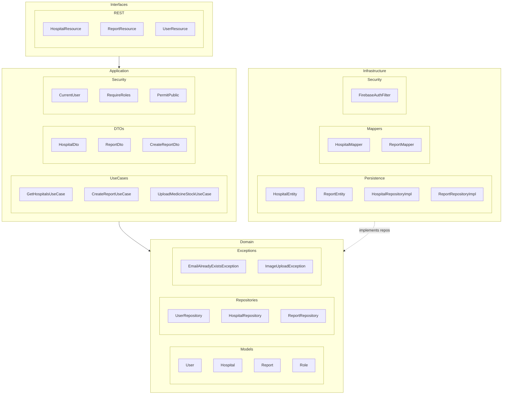
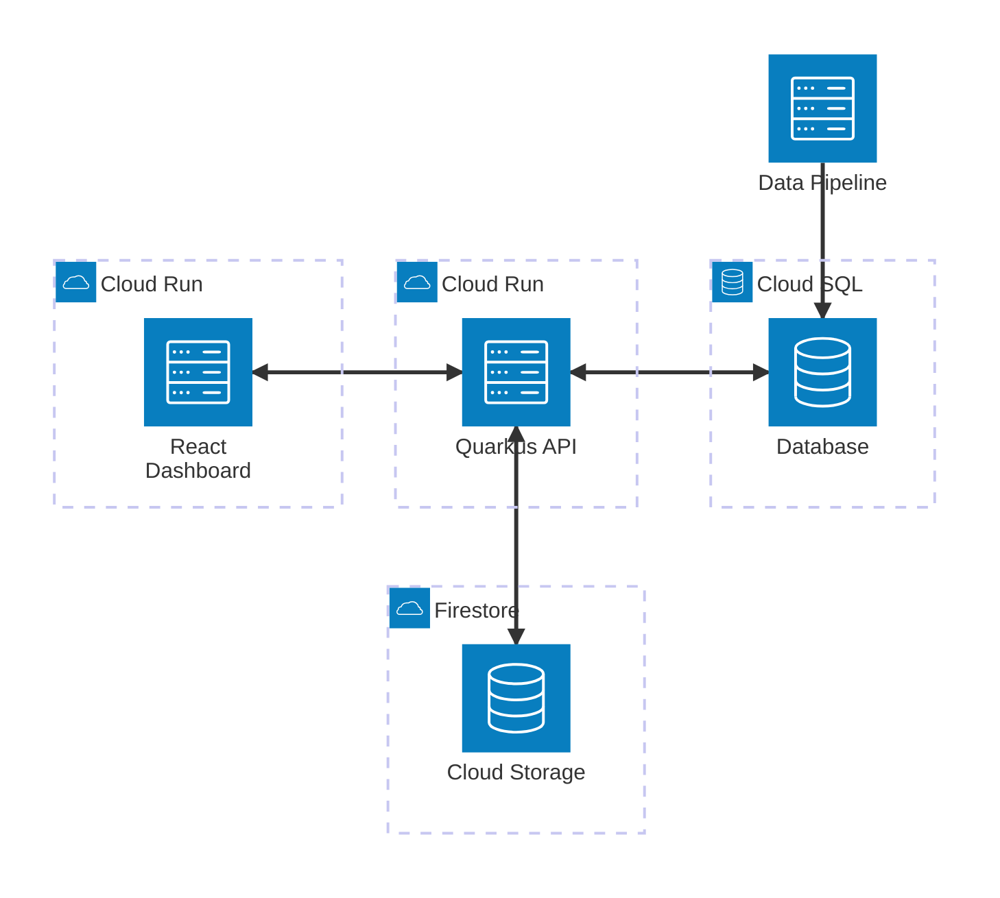

# decision360

Backend API for medicine shortage reporting and hospital supply tracking across Mexico. Citizens report shortages, admins manage data, and the system tracks stock levels over time.

## Tech Stack

- **Quarkus 3.34.3** / Java 21 / Maven (`./mvnw`)
- **Jakarta REST** (quarkus-rest), **Hibernate ORM**, **MySQL** (prod) / **H2** (test)
- **Firebase Admin SDK** — auth + image storage
- **Lombok**, **Mockito**, **REST Assured**

## Architecture

Clean Architecture — no direct imports between domain/application and infrastructure layers. Mappers in `infrastructure/mapper/` convert between them.



### High-Level System Diagram



### Auth Flow

```
Request
  │
  ▼
FirebaseAuthFilter (AUTHENTICATION)
  ├── @PermitPublic? → skip auth
  ├── no Bearer token? → 401
  └── verify token → setCurrentUser
  │
  ▼
RoleAuthorizationFilter (AUTHORIZATION)
  ├── @RequireRoles? → check role
  │     ├── no user → 401
  │     ├── wrong role → 403
  │     └── match → pass
  └── no annotation → pass (any authenticated user)
  │
  ▼
Resource Method
```

## Auth & Roles

| Annotation | Behavior |
|---|---|
| `@PermitPublic` | No token required. If valid token present, populates `CurrentUser` |
| `@RequireRoles({"admin"})` | Listed roles only. 401 if no token, 403 if wrong role |
| neither | Valid token required, any role accepted |

Three roles: `admin`, `health`, `citizen`.

## API Endpoints

| Resource | Path | Description |
|---|---|---|
| `AuthResource` | `/auth` | Google sign-in |
| `UserResource` | `/users` | User management |
| `ReportResource` | `/reports` | Medicine shortage reports |
| `ImageUploadResource` | `/image/upload` | Report image uploads |
| `HospitalResource` | `/hospitals` | Hospital data |
| `MedicineResource` | `/medicines` | Medicine catalog |
| `MedicinesHospitalsResource` | `/medicines-hospitals` | Stock tracking |
| `StateResource` | `/states` | State listing |
| `CityResource` | `/cities` | Cities by state |
| `SuburbResource` | `/suburbs` | Suburbs by city |
| `StatusResource` | `/statuses` | Report statuses |
| `ReportsSnapshotResource` | `/reports-snapshots` | Historical snapshots |
| `HealthResource` | `/health` | Health check |

## Development

```bash
./mvnw quarkus:dev          # Dev mode with live coding
./mvnw test                 # Unit tests
./mvnw test -Dtest=ClassName # Single test class
./mvnw package              # Build JAR
```

Dev UI available at `http://localhost:8080/q/dev/`.

## Githooks

Pre-commit hook runs `./mvnw clean compile` then `./mvnw clean test`:

```bash
git config core.hooksPath .githooks
```

## Testing

Each use case gets both:
1. **Unit test** — `src/test/java/.../usecase/*Test.java` with Mockito
2. **Integration test** — `src/test/java/.../interfaces/rest/*Test.java` with `@QuarkusTest`

### Test Auth Tokens

Seeded via `src/test/resources/import.sql`:

| Token | Role |
|---|---|
| `admin-token` | admin |
| `health-token` | health |
| `citizen-token` | citizen |

### Unit Test Note

`new CurrentUser(user)` calls `user.getRole().getName()` internally. Always set a role:

```java
User user = new User();
user.setRole(new Role((byte) 1, "citizen"));
```

## Database

- **Production**: MySQL — configured via env vars (`DB_KIND`, `DB_USERNAME`, `DB_PASSWORD`, `DB_JDBC_URL`)
- **Tests**: H2 in-memory — `%test` profile in `application.properties`
- **Schema**: `validate` (prod), `drop-and-create` (test)
